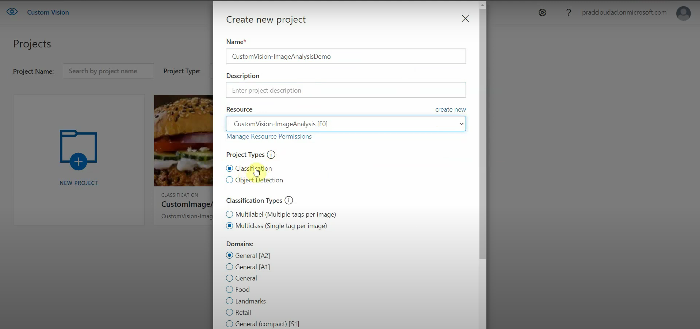

# Custom Image Classification of Fruits and Vegetables using Azure Custom Vision

## Description

This project leverages Azure's Custom Vision service to build a robust image classification model for fruits and vegetables. By training the model on various images of fruits and vegetables, it can accurately identify and classify different types. The Azure Custom Vision service provides a seamless and user-friendly platform to train, deploy, and refine the model, making it accessible for developers and researchers alike. This README contains the process of setting up the environment, training the model, and using it for image classification tasks.

## Steps to Build the Model

### Step 1: Creating a New Image Classification Project

First, log in to the [Custom Vision](https://www.customvision.ai/) portal with your Azure account credentials. Then, create a new Image Classification project.

1. Go to the Custom Vision portal.
2. Click on "New Project."
3. Enter a name for your project (e.g., "Fruit and Vegetable Classifier").
4. Select the "Classification" project type.
5. Choose the "Multiclass (Single tag per image)" classification type.
6. Click "Create Project."

### Step 2: Uploading Images

Next, start uploading images to the project. Ideally, upload them in an organized manner according to the images that will be tagged for image classification.

1. In the project, click on "Add images."
2. Select the images you have categorized (e.g., Apples, Bananas, Oranges, Carrots, Tomatoes).
3. Upload images in batches for each category.
4. Tag each batch of images with the appropriate label (e.g., "Apple" for apple images).

### Step 3: Adding Images

Select the "Add Images" option to upload the images. Load images to tag different categories of fruits and vegetables.

1. Click "Add images" again to add images for another category.
2. Repeat the process until all categories are uploaded and tagged.

### Step 4: Viewing Uploaded Images

Once the image upload is finished, a screen will appear like this:

1. Review the uploaded images to ensure they are correctly tagged.
2. You can click on each tag to view the associated images.

### Step 5: Training the Model

With the data in place, proceed to train the model.

1. Click on the "Train" button.
2. Choose the training type:
   - **Quick Training**: Completes in the shortest possible time based on the number of images and tags.
   - **Advanced Training**: Finds the best possible model within a specified maximum time.
3. Select "Quick Training" for a faster initial model training.

### Step 6: Evaluating the Model

In the Performance section, analyze the model using three metrics: Precision, Recall, and mAP (Mean Average Precision). These metrics help in understanding the following:

- **Precision**: Fraction of identified images that were correct. For example, if the model identified 100 images as apples and 99 were actually apples, the precision would be 99%.
- **Recall**: Fraction of actual classifications that were correctly identified. For example, if there were 100 images with apples and the model identified 80 as apples, the recall would be 80%.
- **mAP**: Mean value of the Average Precision (AP), which is the area under the precision/recall curve for each prediction made.

1. Go to the Performance tab.
2. Review the Precision, Recall, and mAP metrics.
3. Make note of these metrics to assess the model's performance.

### Step 7: Publishing the Model

After establishing and testing the Custom Vision model, you can publish it from the Performance section by selecting an Iteration/Training. Once published, you can use this resource as a web API. You can also export the model in various formats such as TensorFlow, CoreML, Docker container, among others. Note that publishing it online might require some cost.

1. Click on the "Performance" tab.
2. Select the iteration you want to publish.
3. Click "Publish."
4. Provide a name for the endpoint and click "Publish" again.
5. Use the provided API endpoint for integrating with your applications.

---
